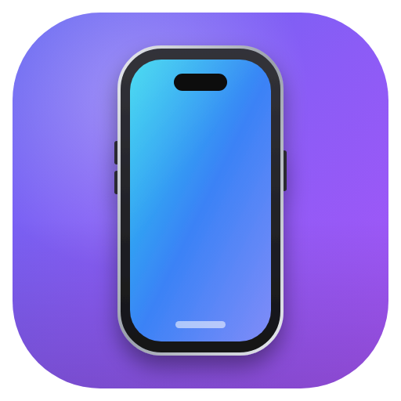
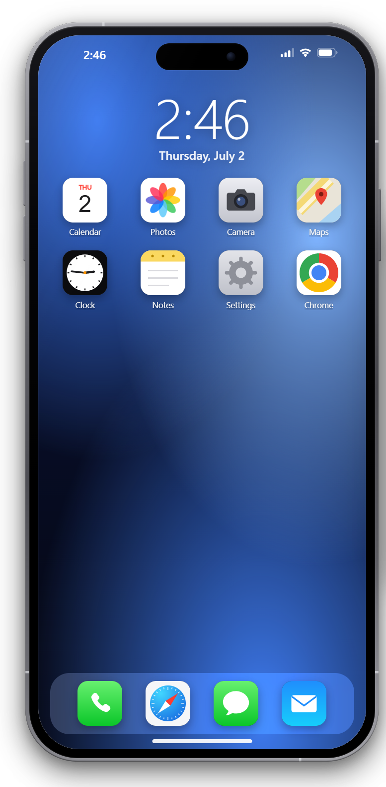
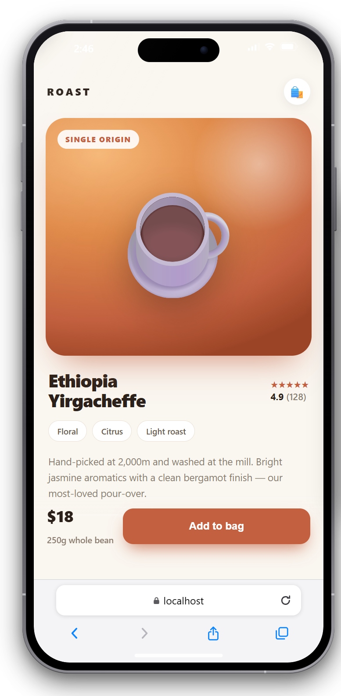
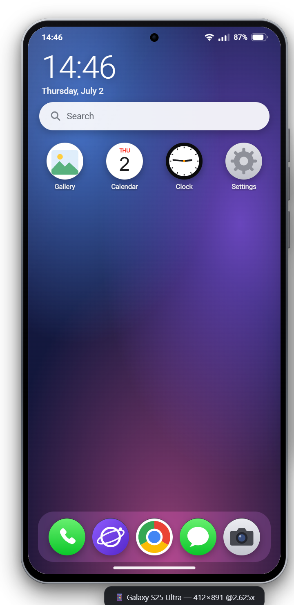
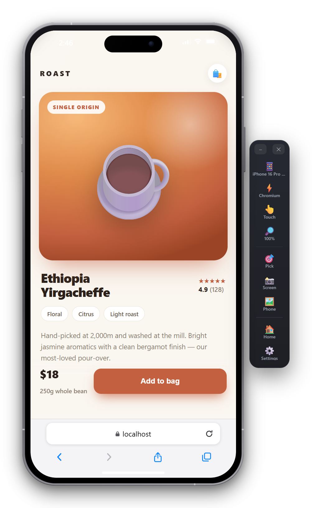
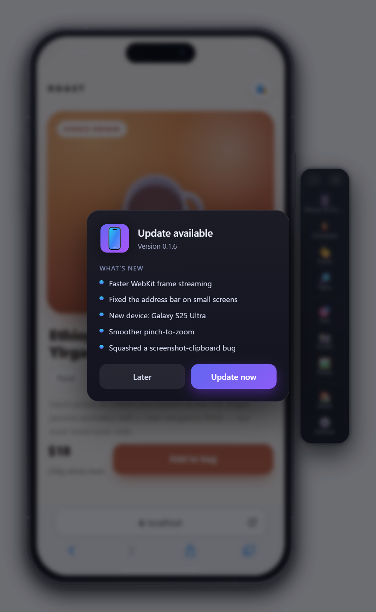

<div align="center">



# 📱 DevPhone

**A phone that lives on your desktop.**

Test mobile-first sites the way your clients actually see them — a realistic,
draggable phone body with the real home screen, browser chrome, PWA install
flow, and a **true WebKit (Safari) engine** running on Windows.

<a href="https://github.com/flodisterhoft-ops/devphone-releases/releases/latest"></a>
&nbsp;
<a href="https://buymeacoffee.com/flodisterhoft"></a>

<p>
  
  
  
</p>

<sub>A real home screen, any site in a real Safari frame, and multiple devices — the window <b>is</b> the phone. Drag it anywhere.</sub>

</div>

---

## Why

There's **no legal, free iOS Safari for Windows**, and Chrome DevTools' device
mode doesn't tell you what a site *feels* like on a phone. DevPhone runs real
mobile-web emulation inside an actual phone body — so the toolbars, safe areas,
home screen, and PWA flow all behave like the real thing.

<div align="center">

<br>
<sub>The floating dock switches device, engine, zoom, and tools — point it at a live URL or your own <code>localhost</code>.</sub>
</div>

## What it does

- **Realistic devices** — iPhone 14 → 17 lineups (incl. iPhone Air), iPhone SE,
  Galaxy S24 → S26 lineups, budget Android, Pixel 9. Exact logical viewports,
  devicePixelRatio, and user agents (researched & verified per device). Scale
  75 / 100 / 125%.
- **Two engines**
  - **Chromium** *(instant)* — full emulation: viewport, DPR, touch, UA +
    client hints, iOS shims (`navigator.standalone`, platform, touch points),
    safe-area insets, `display-mode: standalone`.
  - **WebKit** *(true engine)* — real WebKit via Playwright, streamed into the
    same phone frame. Catches the "Chrome renders it fine but Safari doesn't"
    class of bugs. The closest thing to iOS Safari that runs on Windows.
- **Home screen & PWA flow** — Safari / Chrome / Samsung Internet apps;
  Add-to-Home-Screen reads the site's real manifest; installed apps launch
  standalone (chrome-less) just like a phone. Long-press to wiggle & remove.
- **Browser chrome** — Safari's collapsing bottom pill, Chrome's omnibox,
  Samsung Internet's dual bars — because half of mobile bugs hide behind toolbars.
- **🎯 Element picker** — tap any element; a tidy report (selector, text, box,
  key styles, HTML snippet) lands on your clipboard, ready to paste to an AI
  assistant: *"move this 4px left."*
- **📸 Screenshots** — page-only or the whole phone (pretty frame included),
  saved to `Pictures/DevPhone` + clipboard.
- **Touch & pinch** — the mouse acts as a finger; real touchscreen input passes
  through on touch laptops.
- **🔄 Self-updating** — new versions download and install themselves with an
  in-app changelog; check manually any time in **Settings → About**.
- **New-phone watcher** — checks daily for new iPhone / Galaxy S models and adds
  them with estimated specs (flagged until verified).

## Download

Grab the latest installer from
**[Releases](https://github.com/flodisterhoft-ops/devphone-releases/releases/latest)**,
run it, and you're set — it keeps itself up to date from then on.

> Windows may show a SmartScreen notice (the app isn't code-signed):
> **More info → Run anyway**.

<div align="center">

<br>
<sub>When a new version ships, DevPhone shows you what's new and updates itself.</sub>
</div>

## Run from source

```bash
npm install
npm run webkit:install   # one-time: downloads the WebKit engine (~90 MB)
npm start
```

### Build the installer

```bash
npm run dist             # dist/DevPhone-Setup-*.exe + portable .exe
```

### Selftest (CI-friendly smoke test)

```bash
npx electron . --selftest https://example.com --st-device=galaxy-s26-ultra
# writes selftest.png (window), selftest-screen.png (page), selftest.json (evidence)
# flags use --flag=value form; --st-engine=webkit tests the WebKit pipeline
```

## Honest limitations

- Chromium mode is an emulation: it nails sizes / UA / touch / PWA flow but
  renders with Blink. WebKit mode renders with real WebKit but is **not** iOS
  Safari (no iOS input auto-zoom, toolbar physics, Apple Pay, etc.). The final
  word on iOS-only quirks still belongs to a real iPhone.
- Samsung Internet is emulated as Chromium + Samsung UA + its chrome (faithful
  in practice — the real browser is Chromium-based).

## Device catalog

`devices/devices.json` (seed) + `devices/devices-researched.json` (verified
catalog, overrides seed) + `%APPDATA%/devphone/devices-extra.json`
(auto-discovered). Add your own device by copying any entry.

## Support

DevPhone is free and open source. If it saves you a headache, you can support it:

- ☕ [**Buy me a coffee**](https://buymeacoffee.com/flodisterhoft)
- 💛 [**GitHub Sponsors**](https://github.com/sponsors/flodisterhoft-ops)

## License

[MIT](LICENSE) © Florian Disterhoft

<div align="center"><sub>Built to make mobile-web testing on Windows actually pleasant. 📱</sub></div>
